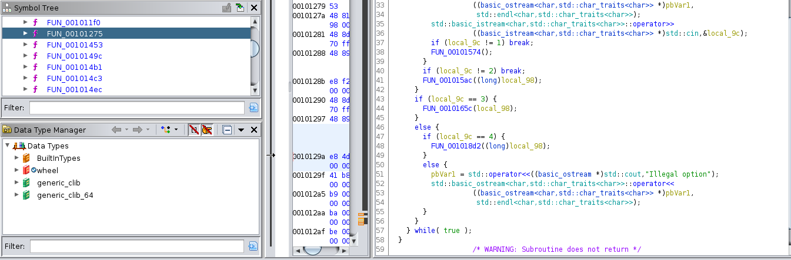
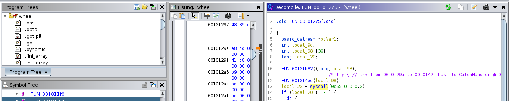
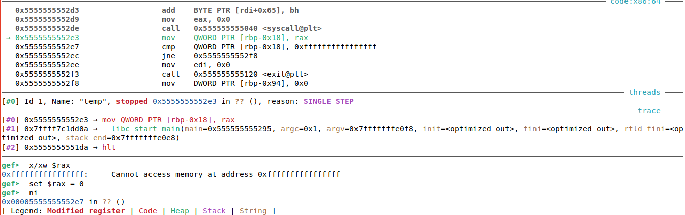
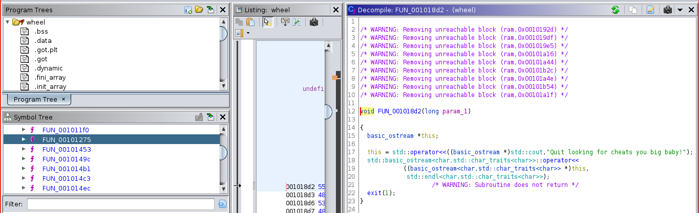
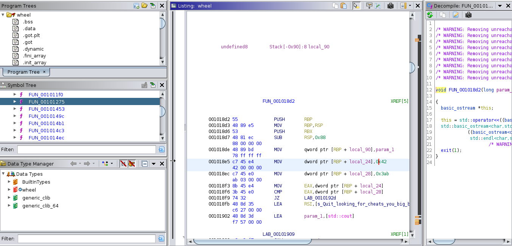
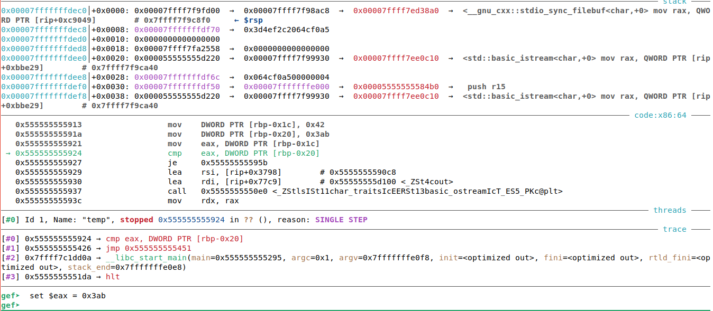
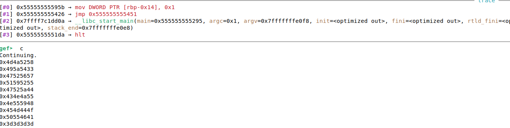

### Solve for roulette wheel

* The first function call made at the start of the main loop is not important,
but the second one is. It seeds the RNG with 2019, making the output of rand() calls predictable.
![rng-seed failed] (img/rng-seed.png)

* Menu options:
	- "Hint" is a troll, it just prints "Try harder in base64 encoding"
	- "Choose" stores the six user choices in a queue.
	- "Play" compares what the user entered vs randomly chosen numbers. 
	It never grants a "win" to the player.
	- As show below, there's an obvious 4th option in the menu branches show in the decompilation.
	


* If a debugger is detected, the program will exit after printing the welcome message.
This is done via the use of ptrace() through a syscall.


To find out what syscall 101(0x65) is, just look here: https://github.com/torvalds/linux/blob/master/arch/x86/entry/syscalls/syscall_64.tbl

To defeat this technique, you can patch the check at runtime with gdb or nop out the call with a hexeditor of your choice.


* The 4th option is going to be the "win" function. As it stands, the only thing that it does is print out a short message.
The warnings about unreachable blocks is a warning sign here


* Using a hexeditor, we can patch the comparison that will never evaluate to true, which only allows this function
to print a message and exit. This can be done at runtime, or with a hexeditor as before.




* As mentioned before, the numbers coming out of the rand() calls are easily predictable.
You can either grab the numbers directly from disassembly, or determine the numbers with a C snippet that seeds srand()
and makes six calls to rand() like so:
```
#include <stdlib.h>
#include <stdio.h>

int main(){
        srand(2019);
        printf("%d\n", rand());
        printf("%d\n", rand());
        printf("%d\n", rand());
        printf("%d\n", rand());
        printf("%d\n", rand());
        printf("%d\n", rand());

}
```



* Once that is done, you must get the character representation of each hex value in the output and merge it together.
This is hinted at by the "Join us" string.

The code for doing so is as follows:
```
a = [0x4d4a5258,
        0x495a5433,
        0x47525657,
        0x51595255,
        0x47525a44,
        0x434e4a55,
        0x4e555948,
        0x454d444f,
        0x50554641,
        0x3d3d3d3d,
        ]

for ent in a:
    for i in range(1, 5):
        index = 4 - i
        char = (ent>>8*index) & 0xff
        print(chr(char), end='')
# echo "MJRXIZT3GRVWQYRUGRZDCNJUNUYHEMDOPUFA====" | base32 -d
# bctf{4khb44r154m0r0n}
```


