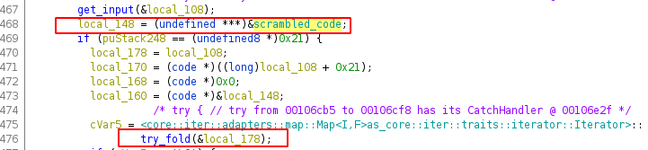

# Solution

When we run the program, we're greeted by

```
Welcome to the scrapyard, choose whatever catches your eye

Would you like to:
[0] Search for an item
[1] Check your cart
[2] Checkout
[3] Remove an item from your cart
[4] Check wallet
[5] Leave

What do you wanna do?

```

After exploring for a bit more we can get a general sense of what the program does. If we open the program in Ghidra, we can see that there is a hidden option.


Looks like there's a discount code..., but how can we get it.

After exploring the decompilation a bit more, we can find the point where the discount code gets checked, looks like we gotta reverse this mysterious try_fold. 



