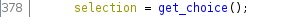
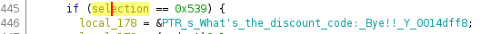

# Solution

First things first, lets get a user's idea of what the program will do by running it.

```
Welcome to the scrapyard, choose whatever catches your eye

Would you like to:
[0] Search for an item
[1] Check your cart
[2] Checkout
[3] Remove an item from your cart
[4] Check wallet
[5] Leave

What do you wanna do?

```

After exploring for a bit more we can get a general sense of what the program does.

If we open the program in Ghidra and trace our way down to where the selection gets processed, we can see that there is a hidden option.





Looks like there's a discount code (and at this point our best guess at what our flag will be), but how can we get it?

Working further down, we can see that we will get prompted for another input and it's expected to be 33 characters long, so its really starting to feel like a flag.

If we give an input of the right length, a pointer to our input, as well as its length and what appears to be the address of the encoded flag, get put into the stack and are passed to `try_fold`.

Skipping over `try_fold` for a second, we can see that if it returns 0, then we will get an affirmative message and the program will exit with 0, so into `try_fold` we go!

One of the first things that I noticed was there was decent bit of book keeping being done by the function, but if we run this in a debugger like GDB hopefully we can get a sense of whats really going on.

However, at the bottom of the listing we can see that there is a check to see if the result of a calculation is equal to some value, and if not, the function will return some value that will be nonzero

```
001078d5 b0 01           MOV        AL,0x1
001078d7 5b              POP        RBX
001078d8 c3              RET
```

we obviously want this check to always be equivalent, so lets figure out what it's checking.

```
001078b0 48 8b 47 10     MOV        RAX,qword ptr [inputs + 0x10]
001078b4 48 83 f8 21     CMP        RAX,0x21
001078b8 73 23           JNC        LAB_001078dd
001078ba 89 c1           MOV        ECX,EAX
001078bc 0f af c8        IMUL       ECX,EAX
001078bf 31 d1           XOR        ECX,EDX
001078c1 49 8b 10        MOV        RDX,qword ptr [R8]
001078c4 48 8d 70 01     LEA        RSI,[RAX + 0x1]
001078c8 38 0c 02        CMP        byte ptr [RDX + RAX*0x1],CL
001078cb 48 89 77 10     MOV        qword ptr [inputs + 0x10],RSI
```

It looks like a number is getting stored in RAX and multiplied with itself, then XORed with data in RDX.

Let's pop open GDB and make one final check before we start implementing this, set a breakpoint here (`b *0x55555555b8ba`) and check what values are getting compared.

So lets start by giving 'A' * 33 as our input.
RDX is 0x41 and RAX is 0, the result gets compared against 0x66 (f), then the program exits and gives us the fail message, good thats what we expected.

Now lets try starting our input with the flag format 'flag{A...}'
On the first iteration RDX is 0x66 (f) and RAX is 0, the result gets stored in RCX and is compared against the first byte of the check data,
on the second iteration RDX is 0x6a (l) and RAX is 1, this then gets checked against the next byte of the check string.

It looks like the pattern is holding, and it is an XOR so we can just use it against the encoded flag to get our flag!

Grab the scrambled bytes from Ghidra or gdb, and decode with python
```
In [23]: ''.join([chr(c^(i*i%256)) for  (i,c) in enumerate(enc)])
Out[23]: 'flag{@_l3ast_u_didn7_g3t_tet4nu5}'
```
